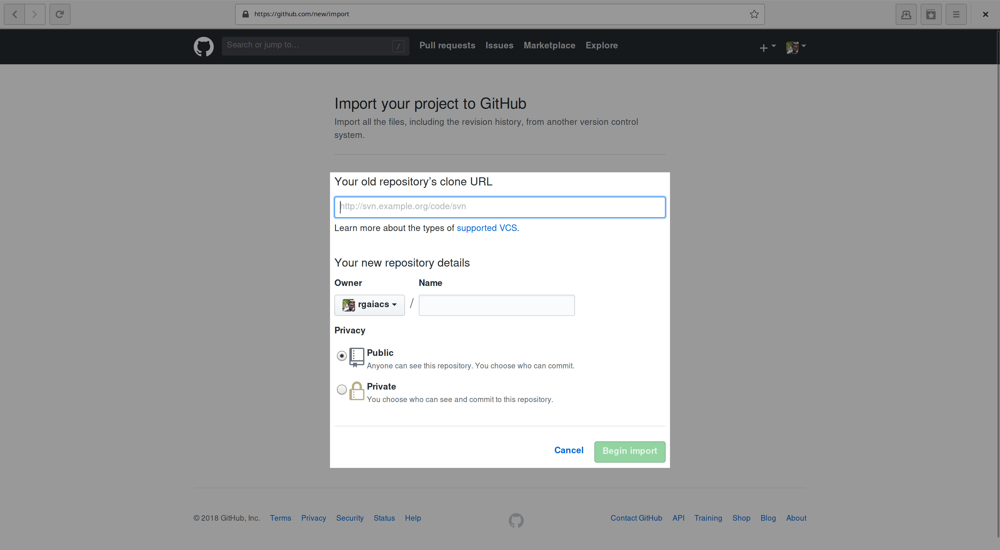
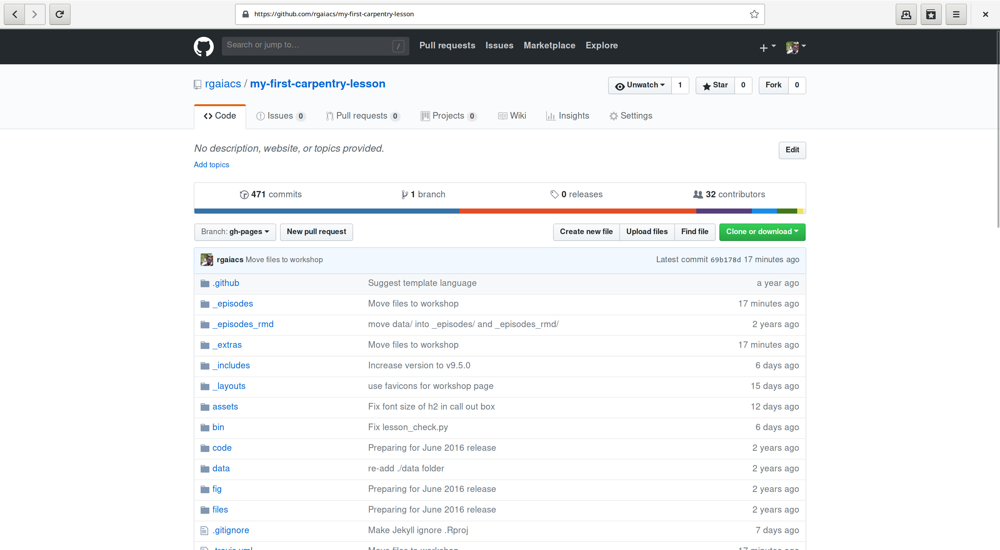

# Bring and Build Your Own Lesson 'Carpentries-style'

## Is this session for you?

### No

- Not interested to use the Carpentry style

### Yes

- Have a lesson to port to the Carpentry style
- Have plans to create a lesson using the Carpentry style
- Is a new maintainer

## Knowledge Required

- How to use GitHub
- How to edit Markdown files

## Knowledge Desired

- How to use the command line
- How to use Git command line

## Minimum device requirements

- Internet connection
- Web browser

## Recommended device requirements

- Git client installed
- Jekyll installed
- Python installed

## Glossary

- **repository**: is the collection of files that hosted on GitHub.
- **fork**: one copy of a repository on GitHub.

## Create repository

Note: The official repository is https://github.com/swcarpentry/styles/
but for this workshop we will use https://github.com/rgaiacs/carpentrycon-workshop-1-styles
which is the result of run `bin/lesson_initialize.py`.

1. Open https://github.com/new/import

   
2. Fill the form with

   Your old repository's clone URL: https://github.com/rgaiacs/carpentrycon-workshop-1-styles

   Your new repository details (Name): my-first-carpentry-lesson

## Edit Metadata

Your repository will be something like

You can add the link to your lesson website,
https://USERNAME.github.io/my-first-carpentry-lesson,
by editing "No description, website, or topics provided."

## Edit `_config.yml`

This is a YAML file with key-values pairs
that you must edit.

## Edit `README.md`

Search for `FIXME` to find the information that you must provide.

## Edit `index.md`

This is the landing page of your lesson.

## Edit `reference.md`

Any definition goes in this file.
It should be formatted as

~~~
{:auto_ids}
key word 1
:   explanation 1

key word 2
:   explanation 2
~~~
{: .source}

## Edit `setup.md`

Include instructions to install any software here.

## Edit `_extras/discuss.md`

Include links to other materials in this file.

## Edit ``_extras/guide.md`

Include notes target to other instructors in this file.

## Previewing

Access https://USERNAME.github.io/my-first-carpentry-lesson.

## Homework

### Edit `AUTHORS`

Add your name and email address to `AUTHORS`.

### Edit `CITATION`

Add instructions for how to cite your lesson.

### Edit `CONTRIBUTING.md`

Search for `FIXME` to fix some links.

### Edit `LICENSE.md`

This file has some statements about the material be owned by The Carpentries.

## FAQ

1. Can I use GitHub online editor to bring my lesson?

   Yes, but you might do things faster with a more powerful text editor.